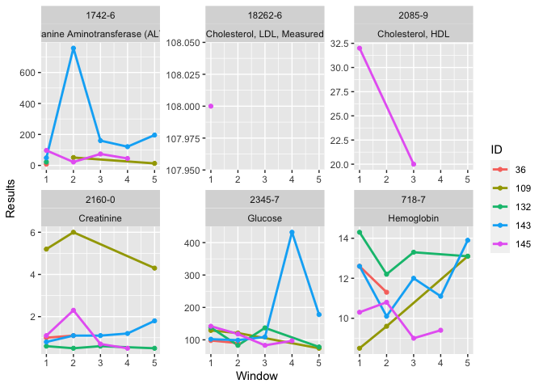

Sample codes in lab package paper
================
Yi-Ju Tseng, Chun Ju Chen

*lab*: An R package for generating analysis-ready data from laboratory
records

``` r
remotes::install_github("DHLab-TSENG/lab")
```

``` r
library(lab)
```

# Data Input - Sample data

``` r
head(labSample)
```

    ##    SUBJECT_ID ITEMID  CHARTTIME VALUENUM VALUEUOM     FLAG
    ## 1:         36  50811 2131-05-18     12.7     g/dL abnormal
    ## 2:         36  50912 2131-05-18      1.2    mg/dL         
    ## 3:         36  51222 2131-05-18     11.9     g/dL abnormal
    ## 4:         36  50912 2131-05-19      1.3    mg/dL abnormal
    ## 5:         36  50931 2131-05-19    160.0    mg/dL abnormal
    ## 6:         36  51222 2131-05-19      9.6     g/dL abnormal

# LONIC Mapping

## Mapping Table

``` r
head(mapSample)
```

    ##    ITEMID                          LABEL FLUID  CATEGORY   LOINC
    ## 1:  50811                     Hemoglobin Blood Blood Gas   718-7
    ## 2:  50861 Alanine Aminotransferase (ALT) Blood Chemistry  1742-6
    ## 3:  50904               Cholesterol, HDL Blood Chemistry  2085-9
    ## 4:  50906     Cholesterol, LDL, Measured Blood Chemistry 18262-6
    ## 5:  50912                     Creatinine Blood Chemistry  2160-0
    ## 6:  50931                        Glucose Blood Chemistry  2345-7

## LONIC Mapping

``` r
loincSample <- mapLOINC(labData = labSample, labItemColName = ITEMID, mappingTable = mapSample)
loincSample[loincSample$SUBJECT_ID==36&loincSample$CHARTTIME=="2131-05-17",]
```

    ##    ITEMID SUBJECT_ID  CHARTTIME VALUENUM VALUEUOM     FLAG
    ## 1:  50811         36 2131-05-17     11.7     g/dL abnormal
    ## 2:  50861         36 2131-05-17     12.0     IU/L         
    ## 3:  50912         36 2131-05-17      2.0    mg/dL abnormal
    ## 4:  50931         36 2131-05-17    125.0    mg/dL abnormal
    ## 5:  51222         36 2131-05-17      7.1     g/dL abnormal
    ##                             LABEL FLUID   CATEGORY  LOINC
    ## 1:                     Hemoglobin Blood  Blood Gas  718-7
    ## 2: Alanine Aminotransferase (ALT) Blood  Chemistry 1742-6
    ## 3:                     Creatinine Blood  Chemistry 2160-0
    ## 4:                        Glucose Blood  Chemistry 2345-7
    ## 5:                     Hemoglobin Blood Hematology  718-7

## Normal or Abnormal Test Results Identificaiton

``` r
loincMarkedSample <- getAbnormalMark(labData = loincSample,
                                     idColName = SUBJECT_ID,
                                     labItemColName = LOINC,
                                     valueColName = VALUENUM,
                                     genderColName = GENDER,
                                     genderTable = patientSample,
                                     referenceTable = refLOINC)
head(loincMarkedSample)
```

    ##    ITEMID  ID  CHARTTIME Value VALUEUOM     FLAG                          LABEL
    ## 1:  50861  36 2131-04-30     8     IU/L          Alanine Aminotransferase (ALT)
    ## 2:  50861  36 2131-05-17    12     IU/L          Alanine Aminotransferase (ALT)
    ## 3:  50861  36 2134-05-14    12     IU/L          Alanine Aminotransferase (ALT)
    ## 4:  50861 109 2138-07-03    14     IU/L          Alanine Aminotransferase (ALT)
    ## 5:  50861 109 2142-03-21    46     IU/L abnormal Alanine Aminotransferase (ALT)
    ## 6:  50861 109 2142-01-09    10     IU/L          Alanine Aminotransferase (ALT)
    ##    FLUID  CATEGORY  LOINC ABMark
    ## 1: Blood Chemistry 1742-6   <NA>
    ## 2: Blood Chemistry 1742-6   <NA>
    ## 3: Blood Chemistry 1742-6   <NA>
    ## 4: Blood Chemistry 1742-6   <NA>
    ## 5: Blood Chemistry 1742-6      H
    ## 6: Blood Chemistry 1742-6   <NA>

## Finding Related Labortory Tests

``` r
caseCreatinine <- searchCasesByLOINC(labData = loincSample,
                                     idColName = SUBJECT_ID,
                                     loincColName = LOINC,
                                     dateColName = CHARTTIME,
                                     condition = "Creatinine",
                                     isSummary = TRUE)

head(caseCreatinine)
```

    ##     ID  LOINC Count firstRecord lastRecode
    ## 1:  36 2160-0    37  2131-04-30 2134-05-20
    ## 2: 109 2160-0   238  2137-11-04 2142-08-30
    ## 3: 132 2160-0    32  2115-05-06 2116-04-08
    ## 4: 143 2160-0    60  2154-12-25 2155-10-22
    ## 5: 145 2160-0   162  2144-03-29 2145-02-22

# Time Series Analysis

## Deciding Width of Windows for Slicing Data

``` r
windowProportion <- plotWindowProportion(labData = loincSample,
                     idColName = SUBJECT_ID,
                     labItemColName = LOINC,
                     dateColName = CHARTTIME,
                     indexDate = first,
                     gapDate = c(30, 90, 180, 360),
                     topN = 5)

head(windowProportion$missingData)
```

    ##        LAB Gap Method Proportion
    ## 1:  1742-6  30  By ID        1.0
    ## 2:  1742-6  90  By ID        0.4
    ## 3:  1742-6 180  By ID        0.4
    ## 4:  1742-6 360  By ID        0.4
    ## 5: 18262-6  30  By ID        0.6
    ## 6: 18262-6  90  By ID        0.6

``` r
print(windowProportion$graph)
```

<!-- -->

## Slicing Data into Time-series Windows

``` r
timeSeriesData <- getTimeSeriesLab(labData = loincSample,
                                   idColName = SUBJECT_ID,
                                   labItemColName = LOINC + LABEL,
                                   dateColName = CHARTTIME,
                                   valueColName = VALUENUM,
                                   indexDate = first,
                                   gapDate = 30,
                                   completeWindows = TRUE)
head(timeSeriesData)
```

    ##    ID  LOINC                          LABEL Window Count Max Min Mean Nearest
    ## 1: 36 1742-6 Alanine Aminotransferase (ALT)      1     2  12   8   10       8
    ## 2: 36 1742-6 Alanine Aminotransferase (ALT)      2    NA  NA  NA   NA      NA
    ## 3: 36 1742-6 Alanine Aminotransferase (ALT)      3    NA  NA  NA   NA      NA
    ## 4: 36 1742-6 Alanine Aminotransferase (ALT)      4    NA  NA  NA   NA      NA
    ## 5: 36 1742-6 Alanine Aminotransferase (ALT)      5    NA  NA  NA   NA      NA
    ## 6: 36 1742-6 Alanine Aminotransferase (ALT)      6    NA  NA  NA   NA      NA
    ##    firstRecord lastRecode
    ## 1:  2131-04-30 2131-05-17
    ## 2:        <NA>       <NA>
    ## 3:        <NA>       <NA>
    ## 4:        <NA>       <NA>
    ## 5:        <NA>       <NA>
    ## 6:        <NA>       <NA>

## Data Visualuzation

``` r
timeSeriesPlot <- plotTimeSeriesLab(labData = timeSeriesData,
                                    idColName = ID,
                                    labItemColName = LOINC + LABEL,
                                    timeMarkColName = Window,
                                    valueColName = Nearest,
                                    timeStart = 1,
                                    timeEnd  = 5,
                                    abnormalMarkColName = NULL)

plot(timeSeriesPlot)
```

<!-- -->

# Data Imputation

``` r
fullTimeSeriesData <- imputeTimeSeriesLab(labData = timeSeriesData,
                                   idColName = ID,
                                   labItemColName = LOINC + LABEL,
                                   windowColName = Window,
                                   valueColName = Mean & Nearest,
                                   impMethod = NOCB)
head(fullTimeSeriesData)
```

    ##    ID  LOINC                          LABEL Window Mean Nearest
    ## 1: 36 1742-6 Alanine Aminotransferase (ALT)      1   10       8
    ## 2: 36 1742-6 Alanine Aminotransferase (ALT)      2   12      12
    ## 3: 36 1742-6 Alanine Aminotransferase (ALT)      3   12      12
    ## 4: 36 1742-6 Alanine Aminotransferase (ALT)      4   12      12
    ## 5: 36 1742-6 Alanine Aminotransferase (ALT)      5   12      12
    ## 6: 36 1742-6 Alanine Aminotransferase (ALT)      6   12      12

# Analysis Ready Data Generation

``` r
wideTimeSeriesData <- wideTimeSeriesLab(labData = fullTimeSeriesData,
                                        idColName = ID,
                                        labItemColName = LOINC + LABEL,
                                        windowColName = Window,
                                        valueColName = Nearest)
head(wideTimeSeriesData)
```

    ##    ID Window 1742-6_Alanine Aminotransferase (ALT)
    ## 1: 36      1                                     8
    ## 2: 36      2                                    12
    ## 3: 36      3                                    12
    ## 4: 36      4                                    12
    ## 5: 36      5                                    12
    ## 6: 36      6                                    12
    ##    18262-6_Cholesterol, LDL, Measured 2085-9_Cholesterol, HDL 2160-0_Creatinine
    ## 1:                                 NA                      NA               1.0
    ## 2:                                 NA                      NA               1.1
    ## 3:                                 NA                      NA               1.2
    ## 4:                                 NA                      NA               1.2
    ## 5:                                 NA                      NA               1.2
    ## 6:                                 NA                      NA               1.2
    ##    2345-7_Glucose 718-7_Hemoglobin
    ## 1:             98             12.6
    ## 2:             90             11.3
    ## 3:            116             14.5
    ## 4:            116             14.5
    ## 5:            116             14.5
    ## 6:            116             14.5
