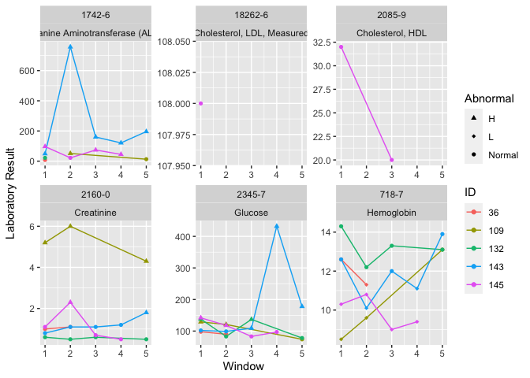

Sample codes in lab package paper
================
Yi-Ju Tseng, Chun Ju Chen

*lab*: An R package for generating analysis-ready data from laboratory
records

``` r
remotes::install_github("DHLab-TSENG/lab")
```

``` r
library(lab)
```

# Data Input - Sample data

``` r
head(labSample)
```

    ##    SUBJECT_ID ITEMID  CHARTTIME VALUENUM VALUEUOM     FLAG
    ## 1:         36  50811 2131-05-18     12.7     g/dL abnormal
    ## 2:         36  50912 2131-05-18      1.2    mg/dL         
    ## 3:         36  51222 2131-05-18     11.9     g/dL abnormal
    ## 4:         36  50912 2131-05-19      1.3    mg/dL abnormal
    ## 5:         36  50931 2131-05-19    160.0    mg/dL abnormal
    ## 6:         36  51222 2131-05-19      9.6     g/dL abnormal

# LONIC Mapping

## Mapping Table

``` r
head(mapSample)
```

    ##    ITEMID                          LABEL FLUID  CATEGORY   LOINC
    ## 1:  50811                     Hemoglobin Blood Blood Gas   718-7
    ## 2:  50861 Alanine Aminotransferase (ALT) Blood Chemistry  1742-6
    ## 3:  50904               Cholesterol, HDL Blood Chemistry  2085-9
    ## 4:  50906     Cholesterol, LDL, Measured Blood Chemistry 18262-6
    ## 5:  50912                     Creatinine Blood Chemistry  2160-0
    ## 6:  50931                        Glucose Blood Chemistry  2345-7

## LONIC Mapping

``` r
loincSample <- mapLOINC(labData = labSample, 
                        labItemColName = ITEMID, 
                        mappingTable = mapSample)
loincSample[loincSample$SUBJECT_ID==36&loincSample$CHARTTIME=="2131-05-17",]
```

    ##    ITEMID SUBJECT_ID  CHARTTIME VALUENUM VALUEUOM     FLAG
    ## 1:  50811         36 2131-05-17     11.7     g/dL abnormal
    ## 2:  50861         36 2131-05-17     12.0     IU/L         
    ## 3:  50912         36 2131-05-17      2.0    mg/dL abnormal
    ## 4:  50931         36 2131-05-17    125.0    mg/dL abnormal
    ## 5:  51222         36 2131-05-17      7.1     g/dL abnormal
    ##                             LABEL FLUID   CATEGORY  LOINC
    ## 1:                     Hemoglobin Blood  Blood Gas  718-7
    ## 2: Alanine Aminotransferase (ALT) Blood  Chemistry 1742-6
    ## 3:                     Creatinine Blood  Chemistry 2160-0
    ## 4:                        Glucose Blood  Chemistry 2345-7
    ## 5:                     Hemoglobin Blood Hematology  718-7

## Normal or Abnormal Test Results Identificaiton

``` r
loincMarkedSample <- getAbnormalMark(labData = loincSample,
                                     idColName = SUBJECT_ID,
                                     labItemColName = LOINC,
                                     valueColName = VALUENUM,
                                     genderColName = GENDER,
                                     genderTable = patientSample,
                                     referenceTable = refLOINC)
head(loincMarkedSample)
```

    ##    ITEMID  ID  CHARTTIME Value VALUEUOM     FLAG                          LABEL
    ## 1:  50861  36 2131-04-30     8     IU/L          Alanine Aminotransferase (ALT)
    ## 2:  50861  36 2131-05-17    12     IU/L          Alanine Aminotransferase (ALT)
    ## 3:  50861  36 2134-05-14    12     IU/L          Alanine Aminotransferase (ALT)
    ## 4:  50861 109 2138-07-03    14     IU/L          Alanine Aminotransferase (ALT)
    ## 5:  50861 109 2142-03-21    46     IU/L abnormal Alanine Aminotransferase (ALT)
    ## 6:  50861 109 2142-01-09    10     IU/L          Alanine Aminotransferase (ALT)
    ##    FLUID  CATEGORY  LOINC ABMark
    ## 1: Blood Chemistry 1742-6   <NA>
    ## 2: Blood Chemistry 1742-6   <NA>
    ## 3: Blood Chemistry 1742-6   <NA>
    ## 4: Blood Chemistry 1742-6   <NA>
    ## 5: Blood Chemistry 1742-6      H
    ## 6: Blood Chemistry 1742-6   <NA>

## Finding Related Labortory Tests

``` r
caseCreatinine <- searchCasesByLOINC(labData = loincSample,
                                     idColName = SUBJECT_ID,
                                     loincColName = LOINC,
                                     dateColName = CHARTTIME,
                                     condition = "Creatinine",
                                     isSummary = TRUE)

head(caseCreatinine)
```

    ##     ID  LOINC Count firstRecord lastRecode
    ## 1:  36 2160-0    37  2131-04-30 2134-05-20
    ## 2: 109 2160-0   238  2137-11-04 2142-08-30
    ## 3: 132 2160-0    32  2115-05-06 2116-04-08
    ## 4: 143 2160-0    60  2154-12-25 2155-10-22
    ## 5: 145 2160-0   162  2144-03-29 2145-02-22

# Time Series Analysis

## Deciding Width of Windows for Slicing Data

``` r
windowProportion <- plotWindowProportion(labData = loincSample,
                                         idColName = SUBJECT_ID,
                                         labItemColName = LOINC,
                                         dateColName = CHARTTIME,
                                         indexDate = first,
                                         gapDate = c(30, 90, 180, 360),
                                         studyPeriodStartDays=0,
                                         studyPeriodEndDays=360)

head(windowProportion$missingData)
```

    ##       LAB Gap        Method Proportion
    ## 1: 1742-6  30 By Individual          0
    ## 2: 1742-6  30 By Individual          0
    ## 3: 1742-6  30 By Individual          0
    ## 4: 1742-6  30 By Individual          0
    ## 5: 1742-6  30 By Individual          0
    ## 6: 2160-0  30 By Individual          0

``` r
print(windowProportion$graph)
```

<!-- -->

## Slicing Data into Time-series Windows

``` r
timeSeriesData <- getTimeSeriesLab(labData = loincSample,
                                   idColName = SUBJECT_ID,
                                   labItemColName = LOINC + LABEL,
                                   dateColName = CHARTTIME,
                                   valueColName = VALUENUM,
                                   indexDate = first,
                                   gapDate = 30,
                                   completeWindows = TRUE)
timeSeriesData[timeSeriesData$ID==36&timeSeriesData$LOINC=="2160-0"]
```

    ##     ID  LOINC      LABEL Window Count Max Min      Mean Nearest firstRecord
    ##  1: 36 2160-0 Creatinine      1    23 2.0 0.7 1.2347826     1.0  2131-04-30
    ##  2: 36 2160-0 Creatinine      2     1 1.1 1.1 1.1000000     1.1  2131-06-22
    ##  3: 36 2160-0 Creatinine      3    NA  NA  NA        NA      NA        <NA>
    ##  4: 36 2160-0 Creatinine      4    NA  NA  NA        NA      NA        <NA>
    ##  5: 36 2160-0 Creatinine      5    NA  NA  NA        NA      NA        <NA>
    ##  6: 36 2160-0 Creatinine      6    NA  NA  NA        NA      NA        <NA>
    ##  7: 36 2160-0 Creatinine      7    NA  NA  NA        NA      NA        <NA>
    ##  8: 36 2160-0 Creatinine      8    NA  NA  NA        NA      NA        <NA>
    ##  9: 36 2160-0 Creatinine      9     2 1.2 1.2 1.2000000     1.2  2132-01-09
    ## 10: 36 2160-0 Creatinine     10     2 1.1 1.1 1.1000000     1.1  2132-02-07
    ## 11: 36 2160-0 Creatinine     11    NA  NA  NA        NA      NA        <NA>
    ## 12: 36 2160-0 Creatinine     12    NA  NA  NA        NA      NA        <NA>
    ## 13: 36 2160-0 Creatinine     13    NA  NA  NA        NA      NA        <NA>
    ## 14: 36 2160-0 Creatinine     14    NA  NA  NA        NA      NA        <NA>
    ## 15: 36 2160-0 Creatinine     15    NA  NA  NA        NA      NA        <NA>
    ## 16: 36 2160-0 Creatinine     16    NA  NA  NA        NA      NA        <NA>
    ## 17: 36 2160-0 Creatinine     17    NA  NA  NA        NA      NA        <NA>
    ## 18: 36 2160-0 Creatinine     18    NA  NA  NA        NA      NA        <NA>
    ## 19: 36 2160-0 Creatinine     19    NA  NA  NA        NA      NA        <NA>
    ## 20: 36 2160-0 Creatinine     20    NA  NA  NA        NA      NA        <NA>
    ## 21: 36 2160-0 Creatinine     21    NA  NA  NA        NA      NA        <NA>
    ## 22: 36 2160-0 Creatinine     22    NA  NA  NA        NA      NA        <NA>
    ## 23: 36 2160-0 Creatinine     23    NA  NA  NA        NA      NA        <NA>
    ## 24: 36 2160-0 Creatinine     24    NA  NA  NA        NA      NA        <NA>
    ## 25: 36 2160-0 Creatinine     25    NA  NA  NA        NA      NA        <NA>
    ## 26: 36 2160-0 Creatinine     26    NA  NA  NA        NA      NA        <NA>
    ## 27: 36 2160-0 Creatinine     27    NA  NA  NA        NA      NA        <NA>
    ## 28: 36 2160-0 Creatinine     28    NA  NA  NA        NA      NA        <NA>
    ## 29: 36 2160-0 Creatinine     29    NA  NA  NA        NA      NA        <NA>
    ## 30: 36 2160-0 Creatinine     30    NA  NA  NA        NA      NA        <NA>
    ## 31: 36 2160-0 Creatinine     31    NA  NA  NA        NA      NA        <NA>
    ## 32: 36 2160-0 Creatinine     32    NA  NA  NA        NA      NA        <NA>
    ## 33: 36 2160-0 Creatinine     33    NA  NA  NA        NA      NA        <NA>
    ## 34: 36 2160-0 Creatinine     34    NA  NA  NA        NA      NA        <NA>
    ## 35: 36 2160-0 Creatinine     35    NA  NA  NA        NA      NA        <NA>
    ## 36: 36 2160-0 Creatinine     36    NA  NA  NA        NA      NA        <NA>
    ## 37: 36 2160-0 Creatinine     37     3 1.0 0.9 0.9666667     1.0  2134-05-11
    ## 38: 36 2160-0 Creatinine     38     6 1.0 0.8 0.8500000     0.9  2134-05-14
    ##     ID  LOINC      LABEL Window Count Max Min      Mean Nearest firstRecord
    ##     lastRecode
    ##  1: 2131-05-25
    ##  2: 2131-06-22
    ##  3:       <NA>
    ##  4:       <NA>
    ##  5:       <NA>
    ##  6:       <NA>
    ##  7:       <NA>
    ##  8:       <NA>
    ##  9: 2132-01-15
    ## 10: 2132-02-08
    ## 11:       <NA>
    ## 12:       <NA>
    ## 13:       <NA>
    ## 14:       <NA>
    ## 15:       <NA>
    ## 16:       <NA>
    ## 17:       <NA>
    ## 18:       <NA>
    ## 19:       <NA>
    ## 20:       <NA>
    ## 21:       <NA>
    ## 22:       <NA>
    ## 23:       <NA>
    ## 24:       <NA>
    ## 25:       <NA>
    ## 26:       <NA>
    ## 27:       <NA>
    ## 28:       <NA>
    ## 29:       <NA>
    ## 30:       <NA>
    ## 31:       <NA>
    ## 32:       <NA>
    ## 33:       <NA>
    ## 34:       <NA>
    ## 35:       <NA>
    ## 36:       <NA>
    ## 37: 2134-05-13
    ## 38: 2134-05-20
    ##     lastRecode

## Data Visualuzation

``` r
timeSeriesPlot <- plotTimeSeriesLab(labData = timeSeriesData,
                                    idColName = ID,
                                    labItemColName = LOINC + LABEL,
                                    timeMarkColName = Window,
                                    valueColName = Nearest,
                                    timeStart = 1,
                                    timeEnd  = 5,
                                    abnormalMarkColName = NULL)

plot(timeSeriesPlot)
```

<!-- -->

``` r
colnames(patientSample)[2]<-"ID"
timeSeriesDataMarked <- getAbnormalMark(labData = timeSeriesData,
                                        idColName = ID,
                                        labItemColName = LOINC,
                                        valueColName = Nearest,
                                        genderColName = GENDER,
                                        genderTable = patientSample,
                                        referenceTable = refLOINC)

timeSeriesPlotMarked <- plotTimeSeriesLab(labData = timeSeriesDataMarked,
                                          idColName = ID,
                                          labItemColName = LOINC + LABEL,
                                          timeMarkColName = Window,
                                          valueColName = Value,
                                          timeStart = 1,
                                          timeEnd  = 5,
                                          abnormalMarkColName = ABMark)

plot(timeSeriesPlotMarked)
```

<!-- --> \# Data Imputation

``` r
timeSeriesData[timeSeriesData$ID==36&timeSeriesData$LOINC=="2160-0"]
```

    ##     ID  LOINC      LABEL Window Count Max Min      Mean Nearest firstRecord
    ##  1: 36 2160-0 Creatinine      1    23 2.0 0.7 1.2347826     1.0  2131-04-30
    ##  2: 36 2160-0 Creatinine      2     1 1.1 1.1 1.1000000     1.1  2131-06-22
    ##  3: 36 2160-0 Creatinine      3    NA  NA  NA        NA      NA        <NA>
    ##  4: 36 2160-0 Creatinine      4    NA  NA  NA        NA      NA        <NA>
    ##  5: 36 2160-0 Creatinine      5    NA  NA  NA        NA      NA        <NA>
    ##  6: 36 2160-0 Creatinine      6    NA  NA  NA        NA      NA        <NA>
    ##  7: 36 2160-0 Creatinine      7    NA  NA  NA        NA      NA        <NA>
    ##  8: 36 2160-0 Creatinine      8    NA  NA  NA        NA      NA        <NA>
    ##  9: 36 2160-0 Creatinine      9     2 1.2 1.2 1.2000000     1.2  2132-01-09
    ## 10: 36 2160-0 Creatinine     10     2 1.1 1.1 1.1000000     1.1  2132-02-07
    ## 11: 36 2160-0 Creatinine     11    NA  NA  NA        NA      NA        <NA>
    ## 12: 36 2160-0 Creatinine     12    NA  NA  NA        NA      NA        <NA>
    ## 13: 36 2160-0 Creatinine     13    NA  NA  NA        NA      NA        <NA>
    ## 14: 36 2160-0 Creatinine     14    NA  NA  NA        NA      NA        <NA>
    ## 15: 36 2160-0 Creatinine     15    NA  NA  NA        NA      NA        <NA>
    ## 16: 36 2160-0 Creatinine     16    NA  NA  NA        NA      NA        <NA>
    ## 17: 36 2160-0 Creatinine     17    NA  NA  NA        NA      NA        <NA>
    ## 18: 36 2160-0 Creatinine     18    NA  NA  NA        NA      NA        <NA>
    ## 19: 36 2160-0 Creatinine     19    NA  NA  NA        NA      NA        <NA>
    ## 20: 36 2160-0 Creatinine     20    NA  NA  NA        NA      NA        <NA>
    ## 21: 36 2160-0 Creatinine     21    NA  NA  NA        NA      NA        <NA>
    ## 22: 36 2160-0 Creatinine     22    NA  NA  NA        NA      NA        <NA>
    ## 23: 36 2160-0 Creatinine     23    NA  NA  NA        NA      NA        <NA>
    ## 24: 36 2160-0 Creatinine     24    NA  NA  NA        NA      NA        <NA>
    ## 25: 36 2160-0 Creatinine     25    NA  NA  NA        NA      NA        <NA>
    ## 26: 36 2160-0 Creatinine     26    NA  NA  NA        NA      NA        <NA>
    ## 27: 36 2160-0 Creatinine     27    NA  NA  NA        NA      NA        <NA>
    ## 28: 36 2160-0 Creatinine     28    NA  NA  NA        NA      NA        <NA>
    ## 29: 36 2160-0 Creatinine     29    NA  NA  NA        NA      NA        <NA>
    ## 30: 36 2160-0 Creatinine     30    NA  NA  NA        NA      NA        <NA>
    ## 31: 36 2160-0 Creatinine     31    NA  NA  NA        NA      NA        <NA>
    ## 32: 36 2160-0 Creatinine     32    NA  NA  NA        NA      NA        <NA>
    ## 33: 36 2160-0 Creatinine     33    NA  NA  NA        NA      NA        <NA>
    ## 34: 36 2160-0 Creatinine     34    NA  NA  NA        NA      NA        <NA>
    ## 35: 36 2160-0 Creatinine     35    NA  NA  NA        NA      NA        <NA>
    ## 36: 36 2160-0 Creatinine     36    NA  NA  NA        NA      NA        <NA>
    ## 37: 36 2160-0 Creatinine     37     3 1.0 0.9 0.9666667     1.0  2134-05-11
    ## 38: 36 2160-0 Creatinine     38     6 1.0 0.8 0.8500000     0.9  2134-05-14
    ##     ID  LOINC      LABEL Window Count Max Min      Mean Nearest firstRecord
    ##     lastRecode
    ##  1: 2131-05-25
    ##  2: 2131-06-22
    ##  3:       <NA>
    ##  4:       <NA>
    ##  5:       <NA>
    ##  6:       <NA>
    ##  7:       <NA>
    ##  8:       <NA>
    ##  9: 2132-01-15
    ## 10: 2132-02-08
    ## 11:       <NA>
    ## 12:       <NA>
    ## 13:       <NA>
    ## 14:       <NA>
    ## 15:       <NA>
    ## 16:       <NA>
    ## 17:       <NA>
    ## 18:       <NA>
    ## 19:       <NA>
    ## 20:       <NA>
    ## 21:       <NA>
    ## 22:       <NA>
    ## 23:       <NA>
    ## 24:       <NA>
    ## 25:       <NA>
    ## 26:       <NA>
    ## 27:       <NA>
    ## 28:       <NA>
    ## 29:       <NA>
    ## 30:       <NA>
    ## 31:       <NA>
    ## 32:       <NA>
    ## 33:       <NA>
    ## 34:       <NA>
    ## 35:       <NA>
    ## 36:       <NA>
    ## 37: 2134-05-13
    ## 38: 2134-05-20
    ##     lastRecode

``` r
fullTimeSeriesData <- imputeTimeSeriesLab(labData = timeSeriesData,
                                          idColName = ID,
                                          labItemColName = LOINC + LABEL,
                                          windowColName = Window,
                                          valueColName = Mean & Nearest,
                                          impMethod = NOCB,
                                          imputeOverallMean = FALSE)

fullTimeSeriesData[timeSeriesData$ID==36&timeSeriesData$LOINC=="2160-0"]
```

    ##     ID  LOINC      LABEL Window      Mean Nearest imputed
    ##  1: 36 2160-0 Creatinine      1 1.2347826     1.0   FALSE
    ##  2: 36 2160-0 Creatinine      2 1.1000000     1.1   FALSE
    ##  3: 36 2160-0 Creatinine      3 1.1000000     1.1    TRUE
    ##  4: 36 2160-0 Creatinine      4 1.1000000     1.1    TRUE
    ##  5: 36 2160-0 Creatinine      5 1.1000000     1.1    TRUE
    ##  6: 36 2160-0 Creatinine      6 1.1000000     1.1    TRUE
    ##  7: 36 2160-0 Creatinine      7 1.1000000     1.1    TRUE
    ##  8: 36 2160-0 Creatinine      8 1.1000000     1.1    TRUE
    ##  9: 36 2160-0 Creatinine      9 1.2000000     1.2   FALSE
    ## 10: 36 2160-0 Creatinine     10 1.1000000     1.1   FALSE
    ## 11: 36 2160-0 Creatinine     11 1.1000000     1.1    TRUE
    ## 12: 36 2160-0 Creatinine     12 1.1000000     1.1    TRUE
    ## 13: 36 2160-0 Creatinine     13 1.1000000     1.1    TRUE
    ## 14: 36 2160-0 Creatinine     14 1.1000000     1.1    TRUE
    ## 15: 36 2160-0 Creatinine     15 1.1000000     1.1    TRUE
    ## 16: 36 2160-0 Creatinine     16 1.1000000     1.1    TRUE
    ## 17: 36 2160-0 Creatinine     17 1.1000000     1.1    TRUE
    ## 18: 36 2160-0 Creatinine     18 1.1000000     1.1    TRUE
    ## 19: 36 2160-0 Creatinine     19 1.1000000     1.1    TRUE
    ## 20: 36 2160-0 Creatinine     20 1.1000000     1.1    TRUE
    ## 21: 36 2160-0 Creatinine     21 1.1000000     1.1    TRUE
    ## 22: 36 2160-0 Creatinine     22 1.1000000     1.1    TRUE
    ## 23: 36 2160-0 Creatinine     23 1.1000000     1.1    TRUE
    ## 24: 36 2160-0 Creatinine     24 1.1000000     1.1    TRUE
    ## 25: 36 2160-0 Creatinine     25 1.1000000     1.1    TRUE
    ## 26: 36 2160-0 Creatinine     26 1.1000000     1.1    TRUE
    ## 27: 36 2160-0 Creatinine     27 1.1000000     1.1    TRUE
    ## 28: 36 2160-0 Creatinine     28 1.1000000     1.1    TRUE
    ## 29: 36 2160-0 Creatinine     29 1.1000000     1.1    TRUE
    ## 30: 36 2160-0 Creatinine     30 1.1000000     1.1    TRUE
    ## 31: 36 2160-0 Creatinine     31 1.1000000     1.1    TRUE
    ## 32: 36 2160-0 Creatinine     32 1.1000000     1.1    TRUE
    ## 33: 36 2160-0 Creatinine     33 1.1000000     1.1    TRUE
    ## 34: 36 2160-0 Creatinine     34 1.1000000     1.1    TRUE
    ## 35: 36 2160-0 Creatinine     35 1.1000000     1.1    TRUE
    ## 36: 36 2160-0 Creatinine     36 1.1000000     1.1    TRUE
    ## 37: 36 2160-0 Creatinine     37 0.9666667     1.0   FALSE
    ## 38: 36 2160-0 Creatinine     38 0.8500000     0.9   FALSE
    ##     ID  LOINC      LABEL Window      Mean Nearest imputed

# Analysis Ready Data Generation

``` r
wideTimeSeriesData <- wideTimeSeriesLab(labData = timeSeriesData,
                                        idColName = ID,
                                        labItemColName = LOINC + LABEL,
                                        windowColName = Window,
                                        valueColName = Nearest)
head(wideTimeSeriesData)
```

    ##    ID Window 1742-6_Alanine Aminotransferase (ALT)
    ## 1: 36      1                                     8
    ## 2: 36      2                                    NA
    ## 3: 36      3                                    NA
    ## 4: 36      4                                    NA
    ## 5: 36      5                                    NA
    ## 6: 36      6                                    NA
    ##    18262-6_Cholesterol, LDL, Measured 2085-9_Cholesterol, HDL 2160-0_Creatinine
    ## 1:                                 NA                      NA               1.0
    ## 2:                                 NA                      NA               1.1
    ## 3:                                 NA                      NA                NA
    ## 4:                                 NA                      NA                NA
    ## 5:                                 NA                      NA                NA
    ## 6:                                 NA                      NA                NA
    ##    2345-7_Glucose 718-7_Hemoglobin
    ## 1:             98             12.6
    ## 2:             90             11.3
    ## 3:             NA               NA
    ## 4:             NA               NA
    ## 5:             NA               NA
    ## 6:             NA               NA

``` r
fullTimeSeriesData <- imputeTimeSeriesLab(labData = timeSeriesData,
                                          idColName = ID,
                                          labItemColName = LOINC + LABEL,
                                          windowColName = Window,
                                          valueColName = Nearest,
                                          impMethod = mean,
                                          imputeOverallMean = FALSE)

wideTimeSeriesData <- wideTimeSeriesLab(labData = fullTimeSeriesData,
                                        idColName = ID,
                                        labItemColName = LOINC + LABEL,
                                        windowColName = Window,
                                        valueColName = Nearest)
head(wideTimeSeriesData)
```

    ##    ID Window 1742-6_Alanine Aminotransferase (ALT)
    ## 1: 36      1                                     8
    ## 2: 36      2                                    10
    ## 3: 36      3                                    10
    ## 4: 36      4                                    10
    ## 5: 36      5                                    10
    ## 6: 36      6                                    10
    ##    18262-6_Cholesterol, LDL, Measured 2085-9_Cholesterol, HDL 2160-0_Creatinine
    ## 1:                                 NA                      NA              1.00
    ## 2:                                 NA                      NA              1.10
    ## 3:                                 NA                      NA              1.05
    ## 4:                                 NA                      NA              1.05
    ## 5:                                 NA                      NA              1.05
    ## 6:                                 NA                      NA              1.05
    ##    2345-7_Glucose 718-7_Hemoglobin
    ## 1:        98.0000         12.60000
    ## 2:        90.0000         11.30000
    ## 3:       102.1667         12.83333
    ## 4:       102.1667         12.83333
    ## 5:       102.1667         12.83333
    ## 6:       102.1667         12.83333
