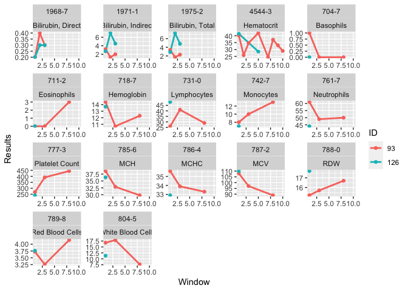
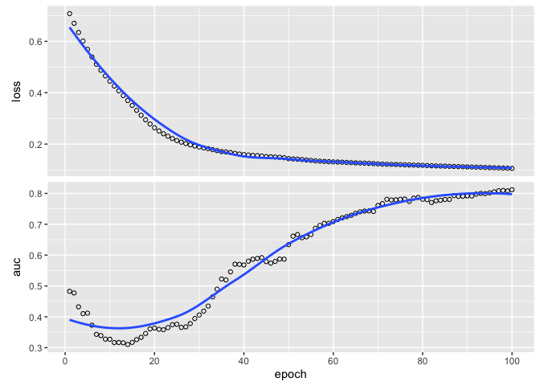

A use case in lab package paper
================
Yi-Ju Tseng, Chun Ju Chen

*lab*: An R package for generating analysis-ready data from laboratory
records

``` r
remotes::install_github("DHLab-TSENG/lab")
remotes::install_github("DHLab-TSENG/dxpr")
```

``` r
library(dxpr)
library(lab)
library(dplyr)
library(data.table)
```

``` r
load("newborn/newborn_ICD.rda")
```

# Case Identification (with dxpr package)

``` r
Case <- selectCases(dxDataFile = newborn_ICD,
                    idColName = SUBJECT_ID,
                    icdColName = ICD9_CODE,
                    dateColName = ADMITTIME,
                    icd10usingDate = "9999/01/01",
                    groupDataType = ICD,
                    caseCondition = "^7470",
                    caseCount = 1,
                    caseName = "PDA")
table(Case$selectedCase)
```

    ## 
    ## non-PDA     PDA 
    ##    7452     381

``` r
PDA<-Case[selectedCase=="PDA"]
```

``` r
head(PDA)
```

|    ID | selectedCase | count | firstCaseDate | endCaseDate | period | MostCommonICD | MostCommonICDCount |
|------:|:-------------|------:|:--------------|:------------|:-------|:--------------|-------------------:|
| 15188 | PDA          |     2 | 2146-05-06    | 2146-05-15  | 9 days | 7470          |                  2 |
|    72 | PDA          |     1 | 2163-09-22    | 2163-09-22  | 0 days | 7470          |                  1 |
|    93 | PDA          |     1 | 2128-03-17    | 2128-03-17  | 0 days | 7470          |                  1 |
|   126 | PDA          |     1 | 2129-08-10    | 2129-08-10  | 0 days | 7470          |                  1 |
|   139 | PDA          |     1 | 2177-09-30    | 2177-09-30  | 0 days | 7470          |                  1 |
|   517 | PDA          |     1 | 2158-09-09    | 2158-09-09  | 0 days | 7470          |                  1 |

# Load Laboratory Records of Cases and Controls

Load laboratory records. Data is not included due to the terms of use.
Please check [Medical Information Mart for Intensive
Care](https://mimic.mit.edu/) for more information.

``` r
if(file.exists("newborn/PDALab.rds")){
  PDALab<-readRDS("newborn/PDALab.rds")
}else{
  LABEVENTS <- fread("newborn/LABEVENTS.csv")
  PDALab<-LABEVENTS[SUBJECT_ID %in% PDA$ID]
  PDALab<-PDALab %>% select(-ROW_ID,-HADM_ID)
  saveRDS(PDALab,"newborn/PDALab.rds")
}
LONICMap<-fread("newborn/D_LABITEMS.csv")
LONICMap<-LONICMap %>% select(-ROW_ID)
Patients<-fread("newborn/PATIENTS.csv")
Patients<-Patients %>% select(-ROW_ID)
PDA<-inner_join(PDA,Patients,by=c("ID"="SUBJECT_ID"))
PDA$DeathDay<-difftime(PDA$DOD_HOSP,PDA$firstCaseDate,units = "days")
PDA$D30<-ifelse(PDA$DeathDay<=30,"Y","N")
PDA$D30<-ifelse(is.na(PDA$D30),"N",PDA$D30)
```

Select laboratory tests which were given to more than 95% of individuals
in the study population.

``` r
PDAItem95<-
  PDALab %>% group_by(ITEMID) %>%
  summarise(Ind=n_distinct(SUBJECT_ID),
            Total=length(unique(PDALab$SUBJECT_ID)),
            Perc=Ind/Total) %>%
  arrange(desc(Perc)) %>%
  filter(Perc>0.95)
PDALab95<-PDALab %>% filter(ITEMID %in% PDAItem95$ITEMID)
```

``` r
head(PDALab95)
```

| SUBJECT_ID | ITEMID | CHARTTIME           | VALUE | VALUENUM | VALUEUOM | FLAG     |
|-----------:|-------:|:--------------------|:------|---------:|:---------|:---------|
|         72 |  51248 | 2163-09-23 11:15:00 | 34.1  |     34.1 | pg       | abnormal |
|         72 |  51249 | 2163-09-23 11:15:00 | 34.7  |     34.7 | %        |          |
|         72 |  51250 | 2163-09-23 11:15:00 | 98    |     98.0 | fL       |          |
|         72 |  51254 | 2163-09-23 11:15:00 | 4     |      4.0 | %        |          |
|         72 |  51256 | 2163-09-23 11:15:00 | 56    |     56.0 | %        | abnormal |
|         72 |  51265 | 2163-09-23 11:15:00 | 160   |    160.0 | K/uL     |          |

# LONIC Mapping

Map laboratory item code (ITEMID) with LOINC. The mapping table
`LONICMap` is provided by [MIMIC](https://mimic.mit.edu/)

``` r
PDALabLONIC <- mapLOINC(labData = PDALab95, 
                        labItemColName = ITEMID, 
                        mappingTable = LONICMap)
```

``` r
head(PDALabLONIC)
```

| ITEMID | SUBJECT_ID | CHARTTIME           | VALUE | VALUENUM | VALUEUOM | FLAG     | LABEL             | FLUID | CATEGORY  | LOINC_CODE |
|-------:|-----------:|:--------------------|:------|---------:|:---------|:---------|:------------------|:------|:----------|:-----------|
|  50883 |         72 | 2163-09-23 23:18:00 | 0.3   |      0.3 | mg/dL    |          | Bilirubin, Direct | Blood | Chemistry | 1968-7     |
|  50883 |         93 | 2128-03-29 23:50:00 | 0.2   |      0.2 | mg/dL    |          | Bilirubin, Direct | Blood | Chemistry | 1968-7     |
|  50883 |         93 | 2128-03-30 23:55:00 | 0.2   |      0.2 | mg/dL    |          | Bilirubin, Direct | Blood | Chemistry | 1968-7     |
|  50883 |         93 | 2128-04-02 04:00:00 | 0.3   |      0.3 | mg/dL    |          | Bilirubin, Direct | Blood | Chemistry | 1968-7     |
|  50883 |         72 | 2163-09-24 16:00:00 | 0.3   |      0.3 | mg/dL    |          | Bilirubin, Direct | Blood | Chemistry | 1968-7     |
|  50883 |         72 | 2163-09-26 00:45:00 | 0.4   |      0.4 | mg/dL    | abnormal | Bilirubin, Direct | Blood | Chemistry | 1968-7     |

## Normal or Abnormal Test Results Identificaiton

Use reference range information `refLOINC` provided by LONIC to identify
normal and abnormal test results. The `Patients` table is used to
provide gender information because reference ranges are different across
gender.

``` r
if(!"LOINC_CODE" %in% colnames(refLOINC)){
  refLOINC<-rename(refLOINC,LOINC_CODE=LOINC)
}
PDALabLONIC_ab <- getAbnormalMark(labData = PDALabLONIC,
                                     idColName = SUBJECT_ID,
                                     labItemColName = LOINC_CODE,
                                     valueColName = VALUENUM,
                                     genderColName = GENDER,
                                     genderTable = Patients,
                                     referenceTable = refLOINC)
```

``` r
head(PDALabLONIC_ab)
```

| ITEMID |  ID | CHARTTIME           | VALUE | Value | VALUEUOM | FLAG     | LABEL             | FLUID | CATEGORY  | LOINC_CODE | ABMark |
|-------:|----:|:--------------------|:------|------:|:---------|:---------|:------------------|:------|:----------|:-----------|:-------|
|  50883 |  72 | 2163-09-23 23:18:00 | 0.3   |   0.3 | mg/dL    |          | Bilirubin, Direct | Blood | Chemistry | 1968-7     | NA     |
|  50883 |  72 | 2163-09-24 16:00:00 | 0.3   |   0.3 | mg/dL    |          | Bilirubin, Direct | Blood | Chemistry | 1968-7     | NA     |
|  50883 |  72 | 2163-09-26 00:45:00 | 0.4   |   0.4 | mg/dL    | abnormal | Bilirubin, Direct | Blood | Chemistry | 1968-7     | H      |
|  50883 |  72 | 2163-09-27 01:50:00 | 0.4   |   0.4 | mg/dL    | abnormal | Bilirubin, Direct | Blood | Chemistry | 1968-7     | H      |
|  50883 |  72 | 2163-09-28 02:30:00 | 0.4   |   0.4 | mg/dL    | abnormal | Bilirubin, Direct | Blood | Chemistry | 1968-7     | H      |
|  50883 |  72 | 2163-09-29 01:30:00 | 0.7   |   0.7 | mg/dL    | abnormal | Bilirubin, Direct | Blood | Chemistry | 1968-7     | H      |

# Time Series Analysis

## Deciding Width of Windows for Slicing Data

Then we need to decide a proper width of window for slicing laboratory
records into time-series window. `plotWindowProportion` helps users
explore the proportion of missing values in each slicing window.

``` r
windowProportion <- plotWindowProportion(labData = PDALabLONIC,
                     idColName = SUBJECT_ID,
                     labItemColName = LABEL,
                     dateColName = CHARTTIME,
                     indexDate = first,
                     gapDate = c(1, 3, 7, 14),
                     studyPeriodStartDays=0,
                     studyPeriodEndDays=31)

print(windowProportion$graph)
```

<!-- -->

``` r
ggplot2::ggsave("windowplot.pdf",dev="pdf",width=8,height=6)
```

The figure shows that using 1 or 3 days window may generate large amount
of missing records and it could affect the analysis results,.

``` r
head(windowProportion$missingData)
```

| LAB               | Gap | Method        | Proportion |
|:------------------|:----|:--------------|-----------:|
| Bilirubin, Direct | 1   | By Individual |  0.0263852 |
| Bilirubin, Direct | 1   | By Individual |  0.0263852 |
| Bilirubin, Direct | 1   | By Individual |  0.0263852 |
| Bilirubin, Direct | 1   | By Individual |  0.0263852 |
| Bilirubin, Direct | 1   | By Individual |  0.0263852 |
| Bilirubin, Direct | 1   | By Individual |  0.0263852 |

## Slice the Data into Time-series Window

Based on the above figure, we choose 7-day window in this analysis.

``` r
PDAIndex<-PDA[,c("ID","firstCaseDate")]
colnames(PDAIndex)<-c("ID","indexDate")
timeSeriesData <- getTimeSeriesLab(labData = PDALabLONIC,
                                   idColName = SUBJECT_ID,
                                   labItemColName = LOINC_CODE + LABEL,
                                   dateColName = CHARTTIME,
                                   valueColName = VALUENUM,
                                   indexDate = PDAIndex,
                                   gapDate = 7,
                                   completeWindows = TRUE)
```

``` r
head(timeSeriesData)
```

|  ID | LOINC_CODE | LABEL               | Window | Count |  Max |  Min |       Mean | Nearest | firstRecord | lastRecode |
|----:|:-----------|:--------------------|-------:|------:|-----:|-----:|-----------:|--------:|:------------|:-----------|
|  72 | 1968-7     | Bilirubin, Direct   |      1 |     6 |  0.4 |  0.2 |  0.3333333 |     0.3 | 2163-09-23  | 2163-09-28 |
|  72 | 1968-7     | Bilirubin, Direct   |      2 |     1 |  0.7 |  0.7 |  0.7000000 |     0.7 | 2163-09-29  | 2163-09-29 |
|  72 | 1971-1     | Bilirubin, Indirect |      1 |     6 | 12.6 |  3.3 |  8.2666667 |     5.3 | 2163-09-23  | 2163-09-28 |
|  72 | 1971-1     | Bilirubin, Indirect |      2 |     1 | 13.1 | 13.1 | 13.1000000 |    13.1 | 2163-09-29  | 2163-09-29 |
|  72 | 1975-2     | Bilirubin, Total    |      1 |     6 | 13.0 |  3.5 |  8.6000000 |     5.6 | 2163-09-23  | 2163-09-28 |
|  72 | 1975-2     | Bilirubin, Total    |      2 |     1 | 13.8 | 13.8 | 13.8000000 |    13.8 | 2163-09-29  | 2163-09-29 |

## Time-series Window Visualization

For some individuals which need further data exploration, users can
visualize the time series data. We randomly choose 5 individuals in this
use case, and found that

``` r
timeSeriesDataInd<-timeSeriesData %>% 
  filter(ID %in% c(93,126))
timeSeriesPlot <- plotTimeSeriesLab(labData = timeSeriesDataInd,
                                    idColName = ID,
                                    labItemColName = LOINC_CODE + LABEL,
                                    timeMarkColName = Window,
                                    valueColName = Nearest,
                                    timeStart = 1,
                                    timeEnd  = 10,
                                    abnormalMarkColName = NULL)

plot(timeSeriesPlot)
```

<!-- -->

``` r
ggplot2::ggsave("timeplot.pdf",dev="pdf",width=8,height=6)
```

## Analysis Ready Data Generation

``` r
WideTimeSeriesData <- wideTimeSeriesLab(labData = timeSeriesData,
                                        idColName = ID,
                                        labItemColName = LOINC_CODE+ LABEL,
                                        windowColName = Window,
                                        valueColName = Nearest)
```

``` r
head(WideTimeSeriesData)
```

|  ID | Window | 1968-7_Bilirubin, Direct | 1971-1_Bilirubin, Indirect | 1975-2_Bilirubin, Total | 4544-3_Hematocrit | 704-7_Basophils | 711-2_Eosinophils | 718-7_Hemoglobin | 731-0_Lymphocytes | 742-7_Monocytes | 761-7_Neutrophils | 777-3_Platelet Count | 785-6_MCH | 786-4_MCHC | 787-2_MCV | 788-0_RDW | 789-8_Red Blood Cells | 804-5_White Blood Cells |
|----:|-------:|-------------------------:|---------------------------:|------------------------:|------------------:|----------------:|------------------:|-----------------:|------------------:|----------------:|------------------:|---------------------:|----------:|-----------:|----------:|----------:|----------------------:|------------------------:|
|  72 |      1 |                      0.3 |                        5.3 |                     5.6 |              47.1 |               0 |                 4 |             15.9 |                73 |               4 |                56 |                  160 |      34.1 |       34.7 |        98 |      16.7 |                  4.09 |                    15.4 |
|  72 |      2 |                      0.7 |                       13.1 |                    13.8 |                NA |              NA |                NA |               NA |                NA |              NA |                NA |                   NA |        NA |         NA |        NA |        NA |                    NA |                      NA |
|  93 |      1 |                      0.2 |                        3.2 |                     3.4 |              40.3 |               1 |                 0 |             14.4 |                26 |               8 |                61 |                  268 |      38.6 |       35.6 |       108 |      15.2 |                  3.72 |                    16.8 |
|  93 |      2 |                      0.4 |                        1.3 |                     1.7 |              25.9 |              NA |                NA |               NA |                NA |              NA |                NA |                   NA |        NA |         NA |        NA |        NA |                    NA |                      NA |
|  93 |      3 |                      0.3 |                        2.0 |                     2.3 |              34.7 |               0 |                 0 |             10.7 |                41 |              10 |                49 |                  391 |      32.9 |       33.9 |        97 |      15.7 |                  3.26 |                    17.9 |
|  93 |      4 |                       NA |                         NA |                      NA |                NA |              NA |                NA |               NA |                NA |              NA |                NA |                   NA |        NA |         NA |        NA |        NA |                    NA |                      NA |

## Compare Laboratory Results between PDA and non-PDA groups

``` r
PDAandLab<-
  inner_join(PDA,WideTimeSeriesData,by="ID")
var<-colnames(PDAandLab)[20:34]
var
```

    ##  [1] "1975-2_Bilirubin, Total" "4544-3_Hematocrit"      
    ##  [3] "704-7_Basophils"         "711-2_Eosinophils"      
    ##  [5] "718-7_Hemoglobin"        "731-0_Lymphocytes"      
    ##  [7] "742-7_Monocytes"         "761-7_Neutrophils"      
    ##  [9] "777-3_Platelet Count"    "785-6_MCH"              
    ## [11] "786-4_MCHC"              "787-2_MCV"              
    ## [13] "788-0_RDW"               "789-8_Red Blood Cells"  
    ## [15] "804-5_White Blood Cells"

We can compare laboratory results in selected window (for example, 1)
between PDA and non-PDA groups. As the table shown, some results were
different between PDA and non-PDA groups.

``` r
t1<-tableone::CreateTableOne(data=PDAandLab %>% filter(Window==1),
                         strata = c("D30"),
                        var=var)
```

``` r
t1p<-print(t1)
write.csv(t1p,"t1p.csv")
```

|                                     | N              | Y              | p     | test |
|:------------------------------------|:---------------|:---------------|:------|:-----|
| n                                   | 367            | 12             |       |      |
| 1975-2_Bilirubin, Total (mean (SD)) | 4.87 (2.50)    | 2.47 (1.21)    | 0.001 |      |
| 4544-3_Hematocrit (mean (SD))       | 46.67 (6.49)   | 43.68 (7.21)   | 0.119 |      |
| 704-7_Basophils (mean (SD))         | 0.23 (0.55)    | 0.33 (0.65)    | 0.543 |      |
| 711-2_Eosinophils (mean (SD))       | 1.85 (2.06)    | 1.42 (1.62)    | 0.469 |      |
| 718-7_Hemoglobin (mean (SD))        | 15.55 (2.23)   | 14.71 (2.13)   | 0.197 |      |
| 731-0_Lymphocytes (mean (SD))       | 54.68 (20.25)  | 55.51 (20.16)  | 0.889 |      |
| 742-7_Monocytes (mean (SD))         | 7.55 (4.47)    | 10.25 (4.37)   | 0.040 |      |
| 761-7_Neutrophils (mean (SD))       | 32.11 (18.49)  | 28.80 (16.61)  | 0.542 |      |
| 777-3_Platelet Count (mean (SD))    | 236.71 (82.48) | 226.50 (73.40) | 0.673 |      |
| 785-6_MCH (mean (SD))               | 37.95 (2.57)   | 40.29 (1.82)   | 0.002 |      |
| 786-4_MCHC (mean (SD))              | 33.31 (1.00)   | 33.37 (1.20)   | 0.855 |      |
| 787-2_MCV (mean (SD))               | 114.03 (8.05)  | 121.00 (7.66)  | 0.003 |      |
| 788-0_RDW (mean (SD))               | 17.07 (1.48)   | 16.68 (1.83)   | 0.372 |      |
| 789-8_Red Blood Cells (mean (SD))   | 4.11 (0.60)    | 3.66 (0.57)    | 0.011 |      |
| 804-5_White Blood Cells (mean (SD)) | 10.19 (7.15)   | 7.33 (3.94)    | 0.170 |      |

## Missing Value Imputation

If the data is prepared for model development, some missing values are
not allowed in some machine learning algorithms. Users can impute the
missing values with NOCB strategy (next observation carried backward)
with `imputeTimeSeriesLab`.

``` r
fullTimeSeriesData <- imputeTimeSeriesLab(labData = timeSeriesData,
                                   idColName = ID,
                                   labItemColName = LOINC_CODE + LABEL,
                                   windowColName = Window,
                                   valueColName = Mean & Nearest,
                                   impMethod = NOCB,
                                   imputeOverallMean = FALSE)
```

``` r
head(fullTimeSeriesData)
```

|  ID | LOINC_CODE | LABEL               | Window |       Mean | Nearest | imputed |
|----:|:-----------|:--------------------|-------:|-----------:|--------:|:--------|
|  72 | 1968-7     | Bilirubin, Direct   |      1 |  0.3333333 |     0.3 | FALSE   |
|  72 | 1968-7     | Bilirubin, Direct   |      2 |  0.7000000 |     0.7 | FALSE   |
|  72 | 1971-1     | Bilirubin, Indirect |      1 |  8.2666667 |     5.3 | FALSE   |
|  72 | 1971-1     | Bilirubin, Indirect |      2 | 13.1000000 |    13.1 | FALSE   |
|  72 | 1975-2     | Bilirubin, Total    |      1 |  8.6000000 |     5.6 | FALSE   |
|  72 | 1975-2     | Bilirubin, Total    |      2 | 13.8000000 |    13.8 | FALSE   |

After imputation, we can convert the records into wide format to
generate the analysis read data.

``` r
FullWideTimeSeriesData <- wideTimeSeriesLab(labData = fullTimeSeriesData,
                                        idColName = ID,
                                        labItemColName = LOINC_CODE+ LABEL,
                                        windowColName = Window,
                                        valueColName = Nearest)
```

``` r
head(FullWideTimeSeriesData)
```

|  ID | Window | 1968-7_Bilirubin, Direct | 1971-1_Bilirubin, Indirect | 1975-2_Bilirubin, Total | 4544-3_Hematocrit | 704-7_Basophils | 711-2_Eosinophils | 718-7_Hemoglobin | 731-0_Lymphocytes | 742-7_Monocytes | 761-7_Neutrophils | 777-3_Platelet Count | 785-6_MCH | 786-4_MCHC | 787-2_MCV | 788-0_RDW | 789-8_Red Blood Cells | 804-5_White Blood Cells |
|----:|-------:|-------------------------:|---------------------------:|------------------------:|------------------:|----------------:|------------------:|-----------------:|------------------:|----------------:|------------------:|---------------------:|----------:|-----------:|----------:|----------:|----------------------:|------------------------:|
|  72 |      1 |                      0.3 |                        5.3 |                     5.6 |              47.1 |               0 |                 4 |             15.9 |                73 |               4 |                56 |                  160 |      34.1 |       34.7 |        98 |      16.7 |                  4.09 |                    15.4 |
|  72 |      2 |                      0.7 |                       13.1 |                    13.8 |              47.1 |               0 |                 4 |             15.9 |                73 |               4 |                56 |                  160 |      34.1 |       34.7 |        98 |      16.7 |                  4.09 |                    15.4 |
|  93 |      1 |                      0.2 |                        3.2 |                     3.4 |              40.3 |               1 |                 0 |             14.4 |                26 |               8 |                61 |                  268 |      38.6 |       35.6 |       108 |      15.2 |                  3.72 |                    16.8 |
|  93 |      2 |                      0.4 |                        1.3 |                     1.7 |              25.9 |               1 |                 0 |             14.4 |                26 |               8 |                61 |                  268 |      38.6 |       35.6 |       108 |      15.2 |                  3.72 |                    16.8 |
|  93 |      3 |                      0.3 |                        2.0 |                     2.3 |              34.7 |               0 |                 0 |             10.7 |                41 |              10 |                49 |                  391 |      32.9 |       33.9 |        97 |      15.7 |                  3.26 |                    17.9 |
|  93 |      4 |                      0.3 |                        2.0 |                     2.3 |              34.7 |               0 |                 0 |             10.7 |                41 |              10 |                49 |                  391 |      32.9 |       33.9 |        97 |      15.7 |                  3.26 |                    17.9 |

## Deep Learning Model Development with Analysis Ready Data

Window =5

``` r
FullPDALab<-
  inner_join(PDA,FullWideTimeSeriesData,by="ID")[1:378,]
TrainData<-FullPDALab %>% 
  filter(Window>0&Window<=5) %>% select(ID,Window,20:34)
TrainDataFill <- TrainData %>%
  tidyr::complete(ID, Window)
TrainDataFill<-TrainDataFill%>%replace(is.na(.), 0)
pureTrain<-TrainDataFill %>% select(-ID,-Window)
TrainArray<-array(unlist(pureTrain),
                  dim=c(378,5,15))
TrainTarget<-FullPDALab %>% select(ID,D30) %>% 
  unique() %>% pull(D30) 
TrainTarget<-array(ifelse(TrainTarget=="Y",1,0))
TrainTargetFinal<-
  array(rep(TrainTarget,5),
        dim=c(378,5,1))
library(keras)

model <- keras_model_sequential()
model %>%
        layer_lstm(16, 
                   batch_input_shape = c(126, 5, 15),
                   return_sequences =TRUE, stateful= TRUE,
                   kernel_regularizer = regularizer_l2(0.001)) %>%
        layer_dropout(rate=0) %>%
        layer_dense(16,activation = 'relu') %>%
        layer_dense(1,activation = 'sigmoid')
model %>% compile(
      loss = 'binary_crossentropy',
      optimizer = 'adam',
      metrics= tensorflow::tf$keras$metrics$AUC())

fit<-model %>% fit(
      x = TrainArray,
      y = TrainTargetFinal,
      batch_size = 126,
      epoch= 100 ,
      verbose = 1,
      shuffle = FALSE
    )
plot(fit)
```

<!-- -->
